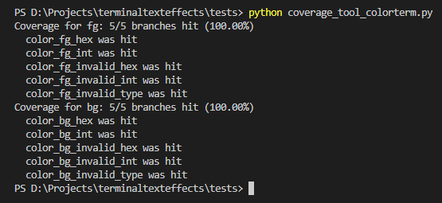
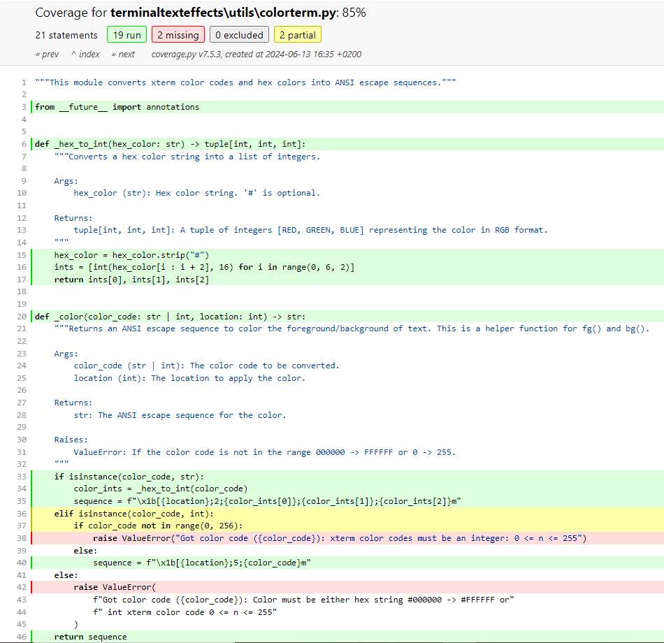
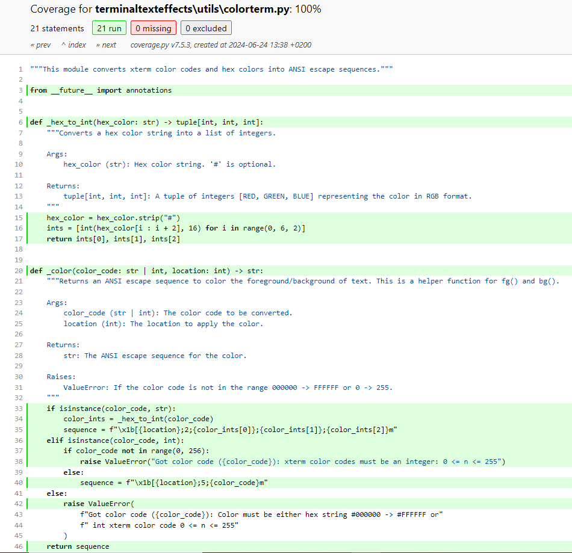
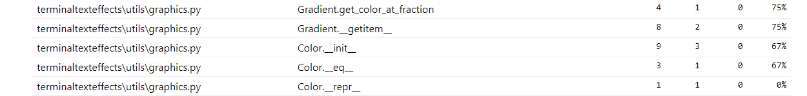
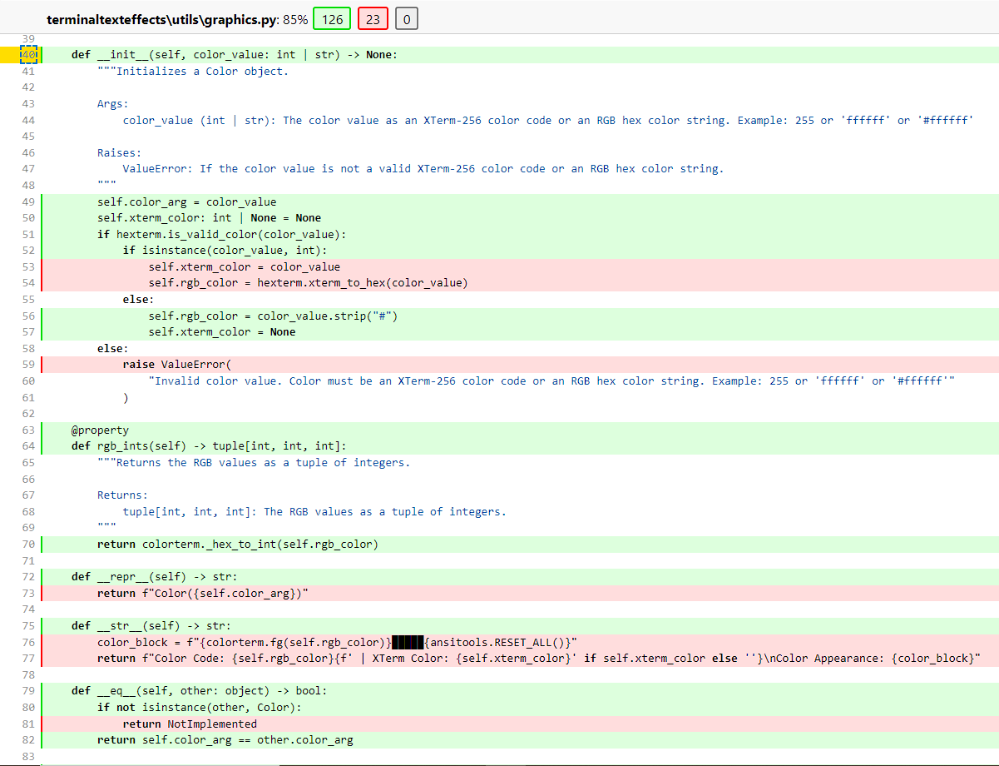
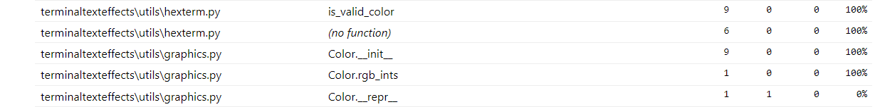
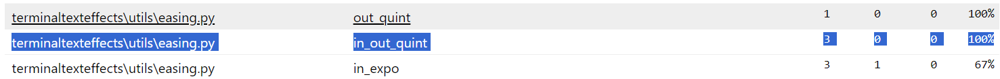

# Report for Assignment 1

## Project Chosen

**Name:** Terminal Text Effects

**URL:** [Terminal Text Effects](https://github.com/ChrisBuilds/terminaltexteffects.git)

**Number of lines of code and the tool used to count it:** 12,482 lines (found by Lizard)

**Programming Language:** Python

## Coverage Measurement

### Existing Tool

**Tool Used:** Coverage.py

1. After cloning the repository, open PowerShell.
2. Run the command:
    ```sh
    coverage run -m pytest tests/
    ```
3. Then run:
    ```sh
    coverage report
    ```
    to get the following report:


### Your Own Coverage Tool

#### Mihail-Dimosthenis Cretu

**Function 1:** `xterm_to_hex`  
**Link:** [Commit](https://github.com/cretud/terminaltexteffects/commit/9e3b9c2da09ec9539e140c4daefb37084e6c3d5d)  
**Screenshot:**  


**Function 2:** `is_valid_color`  
**Link:** [Commit](https://github.com/cretud/terminaltexteffects/commit/9e3b9c2da09ec9539e140c4daefb37084e6c3d5d)  
**Screenshot:**  


**Function 3:** `type_parser`  
**Link:** [Commit](https://github.com/cretud/terminaltexteffects/commit/9e3b9c2da09ec9539e140c4daefb37084e6c3d5d)  
**Screenshot:**  


<Repeat the following for each group member>

#### Arber Gjigolli

**Function 1:** `_color`  
**Link:** [Commit](https://github.com/cretud/terminaltexteffects/pull/1/commits/6689e7fada154f3bb30f7c0e684110f6395adc8f)  
**Screenshot:**  


**Function 2:** `color._init_`  
**Link:** [Commit](https://github.com/cretud/terminaltexteffects/pull/2/commits/b4762d6e708e866b0d8ca8db596edeefef54a0ba)  
**Screenshot:**  


#### Andreas-Stefan Voinopol

**Function 1:** `in_elastic`

**Link:** https://github.com/cretud/terminaltexteffects/blob/main/tests/tool_in_elastic_Andreas.py

**Screenshot:**  


**Function 2:** `GradientDirection.type_parser`

**Link:** https://github.com/cretud/terminaltexteffects/blob/main/tests/tool_gradient_direction_Andreas.py
**Screenshot:** 


#### Ioana-Alexandra Mitran

**Function 1:** `in_out_cubic`

**Link:** (https://github.com/cretud/terminaltexteffects/blob/main/tests/coverage_tool_easing_ioana.py)
**Screenshot:**


**Function 2:** `in_out_quint`

**Link:** (https://github.com/cretud/terminaltexteffects/blob/main/tests/coverage_tool_in_out_quint_ioana.py)
**Screenshot:**


## Coverage Improvement

### Individual Tests

#### Mihail-Dimosthenis Cretu

**Test 1:** `test_type_parser_valid` + **Test 2:** `test_type_parser_invalid`  
**Link:** [Commit](https://github.com/cretud/terminaltexteffects/commit/7d93d87f58fed95296635b5fe2f5cbb58c630c2f)  
**Screenshot Before:**  
  
**Screenshot After:**  
  

*Coverage improved from 0% to 100%.* First test checks the first branch of the method when input is valid and the second one checks the second branch when the input is invalid.

**Test 3:** `test_xterm_to_hex_valid` + **Test 4:** `test_xterm_to_hex_invalid`  
**Link:** [Commit](https://github.com/cretud/terminaltexteffects/commit/7d93d87f58fed95296635b5fe2f5cbb58c630c2f)  
**Screenshot Before:**  
  
**Screenshot After:**  
  

*Coverage improved from 0% to 100%.* First test checks the first branch of the method when input is valid and the second one checks the second branch when the input is invalid.

**Test 5:** `test_is_valid_color_invalid_length` + **Test 6:** `test_is_valid_color_invalid_characters` + **Test 7:** `test_is_valid_color_number`  
**Link:** [Commit](https://github.com/cretud/terminaltexteffects/commit/7d93d87f58fed95296635b5fe2f5cbb58c630c2f)  
**Screenshot Before:**  
  
**Screenshot After:**  
  

*Coverage improved from 56% to 100%.* First test checks the branch of the method when input is invalid by having the wrong string length, the second one checks the branch of the method when input is invalid by having invalid characters in the string, and the last one checks if the method returns true or false based on the value of the integer, outside the range 1-256 false, inside true.

#### Arber Gjigolli

**Test 1:** `test_fg_with_valid_hex_strings`  
**Test 2:** `test_fg_with_valid_int_values`  
**Test 3:** `test_fg_with_invalid_hex_strings`  
**Test 4:** `test_fg_with_invalid_int_values`  
**Test 5:** `test_fg_with_invalid_type`  
**Test 6:** `test_bg_with_valid_hex_strings`  
**Test 7:** `test_bg_with_valid_int_values`  
**Test 8:** `test_bg_with_invalid_hex_strings`  
**Test 9:** `test_bg_with_invalid_int_values`  
**Test 10:** `test_bg_with_invalid_type`  
**Test 11:** `test_fg_edge_cases`  
**Test 12:** `test_bg_edge_cases`  
**Link:** [Commit](https://github.com/cretud/terminaltexteffects/pull/1/commits/7936d8dd2a4328845c3b922784aad32ca1dda21b)  
**Screenshot Before Function Coverage:**  
  
**Screenshot Before File Coverage:**  
  
**Screenshot After Function Coverage:**  
  
**Screenshot After File Coverage:**  
  

*Coverage improved from 78% to 100%* Since _color is a private function, it should not be tested directly. Instead, we test the public functions fg and bg, which internally call _color. By thoroughly testing fg and bg, we ensure that _color is also tested indirectly. The tests for the fg function check valid hex strings and xterm integers.  Invalid hex strings, integers, and types are tested to verify that ValueError is raised. The bg function is similarly tested for valid and invalid inputs. Edge case tests cover hex strings with and without hash symbols and the lowest and highest valid xterm integers, ensuring comprehensive coverage.  

**Test 13:** `test_color_init_with_valid_xterm_color`  
**Test 14:** `test_color_init_with_invalid_color_value`  
**Test 15:** `test_color_init_with_valid_hex_color`  
**Link:** [Commit](https://github.com/cretud/terminaltexteffects/pull/2/commits/73940b1b0ff55716453672415f161ef7c568c417)  
**Screenshot Before Function Coverage:**  
  
**Screenshot Before File Coverage:**  

  
**Screenshot After Function Coverage:**  
  
**Screenshot After File Coverage:**  

  

*Coverage improved from 67% to 100%* These tests ensure comprehensive coverage of the Color class initialization. The first test verifies proper attribute setting for valid XTerm-256 color codes. The second test checks that a ValueError is raised for invalid color values, including non-hex strings and out-of-range integers. The third test confirms correct handling of valid RGB hex color strings, ensuring appropriate attribute assignment.  


#### Andreas-Stefan Voinopol 

**Test 1:** `test_in_elastic_zero`  
**Test 2:** `test_in_elastic_one`  
**Test 3:** `test_in_elastic_mid`  
**Test 4:** `test_in_elastic_near_zero`  
**Test 5:** `test_in_elastic_near_one` 

**Link:** https://github.com/cretud/terminaltexteffects/blob/main/tests/test_in_elastic.py

**Screenshot Before :** 


**Screenshot After :** 

*Coverage improved from 0% to 100%*.Test 1 checks the behavior of the in_elastic function when the input is 0, which is a boundary condition.

test_in_elastic_one: Checks the behavior of the in_elastic function when the input is 1, which is another boundary condition.

test_in_elastic_mid: Checks the behavior of the in_elastic function for an intermediate value (0.5). The expected value is calculated manually using the formula to ensure the function returns the correct output.

test_in_elastic_near_zero: Checks the behavior of the in_elastic function when the input is close to 0 (0.01). The expected value is calculated using the formula to verify the function's accuracy for values near zero.

test_in_elastic_near_one: Checks the behavior of the in_elastic function when the input is close to 1 (0.99). The expected value is calculated using the formula to verify the function's accuracy for values near one.

**Test 6:** `test_valid_gradient_direction_horizontal`  
**Test 7:** `test_valid_gradient_direction_vertical`  
**Test 8:** `test_valid_gradient_direction_diagonal`  
**Test 9:** `test_valid_gradient_direction_radial`  
**Test 10:** `test_invalid_gradient_direction` 

**Link:** https://github.com/cretud/terminaltexteffects/blob/main/tests/test_gradient_direction.py

**Screenshot Before :** 


**Screenshot After :** 

*Coverage improved from 0% to 100%*. 
'test_valid_gradient_direction_horizontal':Checks the type_parser method of GradientDirection when the input is "horizontal". It ensures the method correctly returns Gradient.Direction.HORIZONTAL.

'test_valid_gradient_direction_vertical':Checks the type_parser method of GradientDirection when the input is "vertical". It ensures the method correctly returns Gradient.Direction.VERTICAL.

'test_valid_gradient_direction_diagonal':Checks the type_parser method of GradientDirection when the input is "diagonal". It ensures the method correctly returns Gradient.Direction.DIAGONAL.

'test_valid_gradient_direction_radial':Checks the type_parser method of GradientDirection when the input is "radial". It ensures the method correctly returns Gradient.Direction.RADIAL.

'test_invalid_gradient_direction':Checks the type_parser method of GradientDirection when the input is an invalid direction ("invalid_direction"). It ensures the method raises an argparse.ArgumentTypeError exception for invalid inputs.

#### Ioana-Alexandra Mitran

**Test 1:** `test_in_out_cubic` 
**Link:** (https://github.com/cretud/terminaltexteffects/blob/main/tests/test_easing_ioana.py)  
**Screenshot Before:**  
  
**Screenshot After:**  
  

*Coverage improved from 0% to 100%*
'test_in_out_cubic' : Checks the easing function at key points: the start (0.0), the end (1.0), the midpoint (0.5), and intermediate values (0.25, 0.75). It ensures the function transitions smoothly and symmetrically, using pytest.approx for precise validation at additional points like 0.1, 0.9, 0.499, and 0.501.

**Test 1:** `test_in_out_quint` 
**Link:** (https://github.com/cretud/terminaltexteffects/blob/main/tests/test_in_out_quint_easing_ioana.py)  
**Screenshot Before:**  
  
**Screenshot After:**  
  

*Coverage improved from 0% to 100%*
'test_in_out_quint' : Checks the output at critical points. It ensures smooth transitions and symmetry, using pytest.approx for precise validation at additional points like 0.1, 0.9, 0.499, and 0.501.


### Overall

**Screenshot Before:**  
  

**Screenshot After:**  
  

## Statement of Individual Contributions

- **Mihail-Dimosthenis Cretu:** [Contributions]
- **Arber Gjigolli:** [Contributions]
